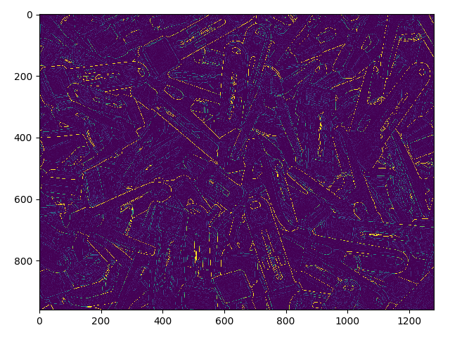

# CannyEdgeForTensorflow
Canny Edge Implementation And Edge Scoring

Reference: https://github.com/ISI-RCG/spicy/blob/master/apps/canny/original/reference.py

This code is Scored Canny Edge code made with tensor flow.
Canny Edge does not discard Weak Edge, but returns a value between 0 and 1.
If you want the original Canny edge code, delete the last 5-line of code.

 
